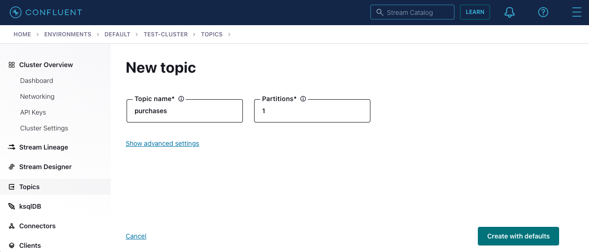

---
seo:
  title: Apache Kafka and .NET - Getting Started Tutorial 
  description: How to develop your first Kafka client application in .NET, which produces and consumes messages from a Kafka cluster, complete with configuration instructions. 
hero:
  title: Getting Started with Apache Kafka and .NET
  description: Step-by-step guide to building a .NET client application for Kafka
---

# Getting Started with Apache Kafka and .NET

## Introduction

In this tutorial, you will build C# client applications which produce and 
consume messages from an Apache Kafka® cluster. 

The easiest way to run Kafka is with [Confluent Cloud](https://www.confluent.io/confluent-cloud/). If you do not already have an account, [signup here](https://www.confluent.io/confluent-cloud/tryfree/). New signups [receive $400](https://www.confluent.io/confluent-cloud-faqs/#how-can-i-get-up-to-dollar400-in-free-confluent-cloud-usage) to spend within Confluent Cloud during their first 60 days.

The tutorial will walk you through setting up a local Kafka cluster if you do not already have access to one.

<div class="alert-primary">
<p>
Note: This tutorial focuses on a simple application to get you started.
If you want to build more complex applications and microservices for data in motion—with powerful features such as real-time joins, aggregations, filters, exactly-once processing, and more—check out the <a href="/learn-kafka/kafka-streams/get-started/">Kafka Streams 101 course</a>, which covers the
<a href="https://docs.confluent.io/platform/current/streams/index.html">Kafka Streams client library</a>.
</p>
</div>

## Prerequisites

This guide assumes that you already have [.NET Core](https://dotnet.microsoft.com/download) (>= 6.0) installed.

Later in this tutorial you will set up a new Kafka cluster or connect
to an existing one. 

If you do not have an existing cluster to use, the easiest way to run Kafka is 
with [Confluent Cloud](https://www.confluent.io/confluent-cloud/). If you do not already have an account, 
[signup here](https://www.confluent.io/confluent-cloud/tryfree/). 
New signups [receive $400](https://www.confluent.io/confluent-cloud-faqs/#how-can-i-get-up-to-dollar400-in-free-confluent-cloud-usage) 
to spend within Confluent Cloud during their first 60 days.

From within the Confluent Cloud console, creating a new cluster is just a few clicks:
<video autoplay muted playsinline poster="https://images.ctfassets.net/gt6dp23g0g38/4JMGlor4A4ad1Doa5JXkUg/7429fd45b2b96d5ce922c990a6b1df77/create-cluster-v2-preview.png" loop>
	<source src="https://videos.ctfassets.net/gt6dp23g0g38/4RJ9frRj03WGhgmPfyfhMB/e1f5e8c719a56d7dcc5c069abd2145da/create-cluster-v2.mp4" type="video/mp4">
Your browser does not support the video tag.
</video>

If you wish instead to run a local Kafka cluster, you will need [Docker](https://docs.docker.com/get-docker/) installed.

## Create Project

Create a new directory anywhere you’d like for this project:

```sh
mkdir kafka-dotnet-getting-started && cd kafka-dotnet-getting-started
```

Next we’ll create two different C# project files, one for the producer and one for the consumer.

Copy the following into a file named `producer.csproj`:
```xml file=producer.csproj
```

Copy the following into a file named `consumer.csproj`:
```xml file=consumer.csproj
```

## Kafka Setup

We are going to need a Kafka Cluster for our client application to
operate with. This dialog can help you configure your Confluent Cloud
cluster, create a Kafka cluster for you, or help you input an existing
cluster bootstrap server to connect to.

<p>
  <div class="select-wrapper">
    <select data-context="true" name="kafka.broker">
      <option value="cloud">Confluent Cloud</option>
      <option value="local">Local</option>
      <option value="other">Other</option>
    </select>
  </div>
</p>

<section data-context-key="kafka.broker" data-context-value="cloud">

<p>
  <label for="kafka-broker-server">Bootstrap Server</label>
  <input id="kafka-broker-server" data-context="true" name="kafka.broker.server" placeholder="cluster-id.region.provider.confluent.cloud:9092" />
</p>

After you sign up for [Confluent Cloud](https://www.confluent.io/confluent-cloud/tryfree/)
and provision your Kafka cluster,
paste your Confluent Cloud bootstrap server setting above and the
tutorial will fill in the appropriate configuration for
you.

You can obtain your Confluent Cloud Kafka cluster bootstrap server
configuration using the [Confluent Cloud Console](https://confluent.cloud/):
<video autoplay muted playsinline poster="https://images.ctfassets.net/gt6dp23g0g38/nrZ31F1vVHVWKpQpBYzi1/91d8e302a87afdfea2ef0a4ffdcc52c4/get-cluster-bootstrap-v2-preview.png" loop>
	<source src="https://videos.ctfassets.net/gt6dp23g0g38/n9l0LvX4FmVZSCGUuHZh3/87f6d318b2caeca0fd9c07f734d98e2f/get-cluster-bootstrap-v2.mp4" type="video/mp4">
Your browser does not support the video tag.
</video>

</section>

<section data-context-key="kafka.broker" data-context-value="local">
  
Paste the following file into a `docker-compose.yml` file:

```yaml file=../docker-compose.yml
```

Now start the Kafka broker with the new `docker compose` command (see the [Docker
documentation for more information](https://docs.docker.com/compose/cli-command/#new-docker-compose-command)).

```sh
docker compose up -d
```

</section>

<section data-context-key="kafka.broker" data-context-value="other">
  
<p>
  <label for="kafka-broker-server">Bootstrap Server</label>
  <input id="kafka-broker-server" data-context="true" name="kafka.broker.server" placeholder="broker:9092" />
</p>

Paste your Kafka cluster bootstrap server URL above and the tutorial will
fill it into the appropriate configuration for you.

</section>

## Configuration

<section data-context-key="kafka.broker" data-context-default>
  Please go back to the Kafka Setup section and select a broker type.
</section>

<section data-context-key="kafka.broker" data-context-value="cloud">

Paste the following configuration data into a file at `getting-started.properties`

The below configuration includes the required settings for a connection
to Confluent Cloud including the bootstrap servers configuration you
provided. 


When using Confluent Cloud you will be required to provide an API key
and secret authorizing your application to produce and consume. You can
use the [Cloud Console](https://confluent.cloud/) to create a key for
you.

Take note of the API key and secret and add them to the configuraiton file.
The `sasl.username` value should contain the API key, 
and the `sasl.password` value should contain the API secret.

```ini file=getting-started-cloud.properties
```

</section>

<section data-context-key="kafka.broker" data-context-value="local">

Paste the following configuration data into a file at `getting-started.properties`

```ini file=getting-started-local.properties
```

</section>

<section data-context-key="kafka.broker" data-context-value="other">

Paste the following configuration data into a file at `getting-started.properties`

The below configuration file includes the bootstrap servers
configuration you provided. If your Kafka Cluster requires different
client security configuration, you may require [different
settings](https://kafka.apache.org/documentation/#security).

```ini file=getting-started-other.properties
```

</section>

## Create Topic

Events in Kafka are organized and durably stored in named topics. Topics
have parameters that determine the performance and durability guarantees
of the events that flow through them.

Create a new topic, `purchases`, which we will use to produce and consume
events.

<section data-context-key="kafka.broker" data-context-value="cloud">



When using Confluent Cloud, you can use the [Cloud
Console](https://confluent.cloud/) to create a topic. Create a topic
with 1 partition and defaults for the remaining settings.

</section>

<section data-context-key="kafka.broker" data-context-value="local">

We'll use the `kafka-topics` command located inside the local running
Kafka broker:

```sh file=../create-topic.sh
```
</section>

<section data-context-key="kafka.broker" data-context-value="other">

Depending on your available Kafka cluster, you have multiple options
for creating a topic. You may have access to [Confluent Control
Center](https://docs.confluent.io/platform/current/control-center/index.html),
where you can [create a topic with a
UI](https://docs.confluent.io/platform/current/control-center/topics/create.html). You
may have already installed a Kafka distribution, in which case you can
use the [kafka-topics command](https://kafka.apache.org/documentation/#basic_ops_add_topic).
Note that, if your cluster is centrally managed, you may need to
request the creation of a topic from your operations team.

</section>

## Build Producer

First, we are going to create the producer application by pasting the following code into a file named `producer.cs`:

```c# file=producer.cs
```

You can test the syntax before preceding by compiling with:
```sh
dotnet build producer.csproj
```

## Build Consumer

To create the consumer application, paste the following C# code into a file named `consumer.cs`:
```c# file=consumer.cs
```

You can test the syntax before preceding by compiling with:
```sh
dotnet build consumer.csproj
```

## Produce Events
The `dotnet` command line tool gives us a handy `run` command we can use to execute the programs we just built.

In order to run the producer, use the `dotnet run` command passing in the configuration file created above:

```sh
dotnet run --project producer.csproj $(pwd)/getting-started.properties
```

You should see output that resembles:
```sh
Produced event to topic purchases: key = jsmith        value = alarm clock
Produced event to topic purchases: key = htanaka       value = book
Produced event to topic purchases: key = eabara        value = batteries
Produced event to topic purchases: key = htanaka       value = t-shirts
Produced event to topic purchases: key = htanaka       value = t-shirts
Produced event to topic purchases: key = htanaka       value = gift card
Produced event to topic purchases: key = sgarcia       value = gift card
Produced event to topic purchases: key = jbernard   value = gift card
Produced event to topic purchases: key = awalther   value = alarm clock
Produced event to topic purchases: key = htanaka       value = book
10 events were produced to topic purchases
```

## Consume Events

From another terminal, run the following command to run the consumer application which will 
read the events from the `purchases` topic and write the information to the terminal.

```sh
dotnet run --project consumer.csproj $(pwd)/getting-started.properties 
```

The consumer application will start and print any events it has not yet consumed and then wait 
for more events to arrive. On startup of the consumer, you should see output that resembles what's below. 

Once you are done with the consumer, press `ctrl-c` to terminate the consumer application.
```sh
Consumed event from topic purchases: key = jsmith     value = alarm clock
Consumed event from topic purchases: key = htanaka    value = book
Consumed event from topic purchases: key = eabara     value = batteries
Consumed event from topic purchases: key = htanaka    value = t-shirts
Consumed event from topic purchases: key = htanaka    value = t-shirts
Consumed event from topic purchases: key = htanaka    value = gift card
Consumed event from topic purchases: key = sgarcia    value = gift card
Consumed event from topic purchases: key = jbernard   value = gift card
Consumed event from topic purchases: key = awalther   value = alarm clock
Consumed event from topic purchases: key = htanaka    value = book
```

Re-run the producer to see more events, or feel free to modify the code as 
necessary to create more or different events.

## Where next?

- For the C# client API, check out the
  [.NET documentation](https://docs.confluent.io/platform/current/clients/confluent-kafka-dotnet/_site/api/Confluent.Kafka.html).
- The blog post [Implement a Cross-Platform Apache Kafka® Producer and Consumer with C# and .NET](https://www.confluent.io/blog/build-cross-platform-kafka-applications-using-c-and-dotnet-5/) provides step-by-step instructions for building an application that streams Wikipedia edit events to a Kafka topic in Confluent Cloud.
- For information on testing in the Kafka ecosystem, check out
  [Testing Event Streaming Apps](/learn/testing-kafka).
- If you're interested in using streaming SQL for data creation,
  processing, and querying in your applications, check out the
  [ksqlDB 101 course](/learn-kafka/ksqldb/intro/).
- Interested in performance tuning of your event streaming applications?
  Check out the [Kafka Performance resources](/learn/kafka-performance/).
