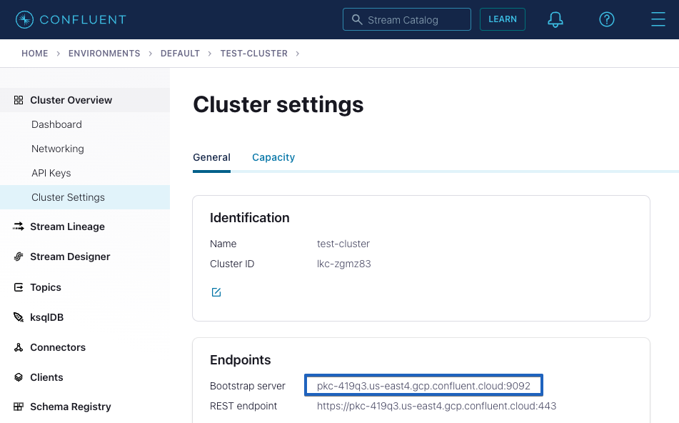

---
seo:
  title: Apache Kafka and Go - Getting Started Tutorial 
  description: How to develop your first Kafka client application in Golang, which produces and consumes messages from a Kafka cluster, complete with configuration instructions. 
hero:
  title: Getting Started with Apache Kafka and Go
  description: Step-by-step guide to building a Go client application for Kafka 
---

# Getting Started with Apache Kafka and Go

## Introduction

In this tutorial, you will build Go client applications which produce and 
consume messages from an Apache Kafka® cluster. 

The easiest way to run Kafka is with [Confluent Cloud](https://www.confluent.io/confluent-cloud/). If you do not already have an account, [signup here](https://www.confluent.io/confluent-cloud/tryfree/). New signups [receive $400](https://www.confluent.io/confluent-cloud-faqs/#how-can-i-get-up-to-dollar400-in-free-confluent-cloud-usage) to spend within Confluent Cloud during their first 60 days.

The tutorial will walk you through setting up a local Kafka cluster if you do not already have access to one.

## Prerequisites

This guide assumes that you already have the [Go language tools](https://golang.org/doc/install) installed.

Later in this tutorial you will set up a new Kafka cluster or connect
to an existing one. The simplest way to get started is to create
your cluster in [Confluent Cloud](https://www.confluent.io/confluent-cloud/tryfree/).
If you wish instead to run a local Kafka cluster, you will
also need [Docker](https://docs.docker.com/get-docker/) installed.

## Create Project

Create a new directory anywhere you’d like for this project:

```sh
mkdir kafka-go-getting-started && cd kafka-go-getting-started
```

## Kafka Setup

We are going to need a Kafka Cluster for our client application to
operate with. This dialog can help you configure your Confluent Cloud
cluster, create a Kafka cluster for you, or help you input an existing
cluster bootstrap server to connect to.

<p>
  <div class="select-wrapper">
    <select data-context="true" name="kafka.broker">
      <option value="">Select Kafka Broker</option>
      <option value="cloud">Confluent Cloud</option>
      <option value="local">Local</option>
      <option value="other">Other</option>
    </select>
  </div>
</p>

<section data-context-key="kafka.broker" data-context-value="cloud">

<p>
  <label for="kafka-broker-server">Bootstrap Server</label>
  <input id="kafka-broker-server" data-context="true" name="kafka.broker.server" placeholder="cluster-id.region.provider.confluent.cloud:9092" />
</p>

After you sign up for [Confluent Cloud](https://www.confluent.io/confluent-cloud/tryfree/)
and provision your Kafka cluster,
paste your Confluent Cloud bootstrap server setting above and the
tutorial will fill in the appropriate configuration for
you.

You can obtain your Confluent Cloud Kafka cluster bootstrap server
configuration using the [Confluent Cloud Console](https://confluent.cloud/).



</section>

<section data-context-key="kafka.broker" data-context-value="local">
  
Paste the following file into a `docker-compose.yml` file:

```yaml file=../docker-compose.yml
```

Now start the Kafka broker with the new `docker compose` command (see the [Docker
documentation for more information](https://docs.docker.com/compose/cli-command/#new-docker-compose-command)).

```sh
docker compose up -d
```

</section>

<section data-context-key="kafka.broker" data-context-value="other">
  
<p>
  <label for="kafka-broker-server">Bootstrap Server</label>
  <input id="kafka-broker-server" data-context="true" name="kafka.broker.server" placeholder="broker:9092" />
</p>

Paste your Kafka cluster bootstrap server URL above and the tutorial will
fill it into the appropriate configuration for you.

</section>

## Configuration

<section data-context-key="kafka.broker" data-context-default>
  Please go back to the Kafka Setup section and select a broker type.
</section>

<section data-context-key="kafka.broker" data-context-value="cloud">

Paste the following configuration data into a file at:
`getting-started.properties`

The below configuration file includes the required settings for a
connection to Confluent Cloud including the bootstrap servers
configuration you provided. Include your Kafka cluster key and secret
in the `sasl.username` and `sasl.password` settings after pasting the file.

```go file=getting-started-cloud.properties
```
</section>

<section data-context-key="kafka.broker" data-context-value="local">

Paste the following configuration data into a file at:
`getting-started.properties`

```go file=getting-started-local.properties
```
</section>


<section data-context-key="kafka.broker" data-context-value="other">

Paste the following configuration data into a file at:
`getting-started.properties`

The below configuration file includes the bootstrap servers
configuration you provided. If your Kafka Cluster requires different
client security configuration, you may require [different
settings](https://kafka.apache.org/documentation/#security).

```go file=getting-started-other.properties
```
</section>

## Create Topic

Events in Kafka are organized and durably stored in named topics. Topics
have parameters that determine the performance and durability guarantees
of the events that flow through them.

Create a new topic, `purchases`, which we will use to produce and consume
events.

<section data-context-key="kafka.broker" data-context-value="cloud">


When using Confluent Cloud, you can use the [Cloud
Console](https://confluent.cloud/) to create a topic. Create a topic
with 1 partition and defaults for the remaining settings.

</section>


<section data-context-key="kafka.broker" data-context-value="local">

We'll use the `kafka-topics` command located inside the local running
Kafka broker:

```sh file=../create-topic.sh
```

</section>

<section data-context-key="kafka.broker" data-context-value="other">

Depending on your available Kafka cluster, you have multiple options
for creating a topic. You may have access to [Confluent Control
Center](https://docs.confluent.io/platform/current/control-center/index.html),
where you can [create a topic with a
UI](https://docs.confluent.io/platform/current/control-center/topics/create.html). You
may have already installed a Kafka distribution, in which case you can
use the [kafka-topics command](https://kafka.apache.org/documentation/#basic_ops_add_topic).
Note that, if your cluster is centrally managed, you may need to
request the creation of a topic from your operations team.

</section>

## Build Producer
First we are going to create a shared code file which contains a helper function we will use to load configuration files for our applications. Paste the following Go code into a file named `util.go`.

```go file=util.go
```

Next we are going to create the producer application by pasting the following Go code into a file named `producer.go`.

```go file=producer.go
```

Before building the code, you may need to download the Confluent Go Kafka dependency with:
```sh
go get github.com/confluentinc/confluent-kafka-go/kafka
```

You can test the syntax before proceeding by compiling with:
```sh
go build -o out/producer util.go producer.go
```

## Build Consumer
Paste the following Go code into a file named `consumer.go`.

```go file=consumer.go
```

You can test the consumer syntax by compiling with:

```sh
go build -o out/consumer util.go consumer.go
```

## Produce Events
First be sure you have successfully compiled the producer code with:

```sh
go build -o out/producer util.go producer.go
```

In order to run the producer, execute the compiled binary passing in the configuration file created above:

```sh
./out/producer getting-started.properties
```

You should see output that resembles:

```sh
Produced event to topic purchases: key = awalther   value = t-shirts
Produced event to topic purchases: key = awalther   value = batteries
Produced event to topic purchases: key = jsmith     value = gift card
Produced event to topic purchases: key = jsmith     value = book
Produced event to topic purchases: key = htanaka    value = book
Produced event to topic purchases: key = sgarcia    value = alarm clock
Produced event to topic purchases: key = eabara     value = batteries
Produced event to topic purchases: key = htanaka    value = batteries
Produced event to topic purchases: key = jbernard   value = book
Produced event to topic purchases: key = awalther   value = alarm clock
```

## Consume Events
From another terminal, run the following command to run the consumer application which will read the events from the purchases topic and write the information to the terminal.

```sh
./out/consumer getting-started.properties 
```

The consumer application will start and print any events it has not yet consumed and then wait for more events to arrive. On startup of the consumer, you should see output that resembles the below. Once you are done with the consumer, press `ctrl-c` to terminate the consumer application.

```sh
Consumed event from topic purchases: key = jsmith     value = alarm clock
Consumed event from topic purchases: key = htanaka    value = book
Consumed event from topic purchases: key = eabara     value = batteries
Consumed event from topic purchases: key = htanaka    value = t-shirts
Consumed event from topic purchases: key = htanaka    value = t-shirts
Consumed event from topic purchases: key = htanaka    value = gift card
Consumed event from topic purchases: key = sgarcia    value = gift card
Consumed event from topic purchases: key = jbernard   value = gift card
Consumed event from topic purchases: key = awalther   value = alarm clock
Consumed event from topic purchases: key = htanaka    value = book
```

Re-run the producer to see more events, or feel free to modify the code as necessary to create more or different events.

## Where next?

- For the Go client API, check out the
  [Go documentation](https://pkg.go.dev/github.com/confluentinc/confluent-kafka-go/kafka).
- For information on testing in the Kafka ecosystem, check out
  [Testing Event Streaming Apps](/learn/testing-kafka).
- If you're interested in using streaming SQL for data creation,
  processing, and querying in your applications, check out the
  [ksqlDB 101 course](/learn-kafka/ksqldb/intro/).
- Interested in performance tuning of your event streaming applications?
  Check out the [Kafka Performance resources](/learn/kafka-performance/).
