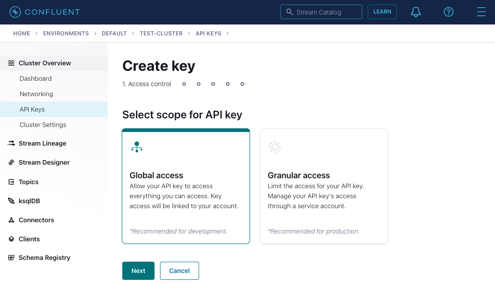

---
seo:
  title: Apache Kafka and Go - Getting Started Tutorial 
  description: How to develop your first Kafka client application in Golang, which produces and consumes messages from a Kafka cluster, complete with configuration instructions. 
hero:
  title: Getting Started with Apache Kafka and Go
  description: Step-by-step guide to building a Go client application for Kafka 
---

# Getting Started with Apache Kafka and Go

## Introduction

In this tutorial, you will build Go client applications which produce and consume messages from an Apache Kafka® cluster. 

As you're learning how to run your first Kafka application, we recommend using [Confluent Cloud](https://www.confluent.io/confluent-cloud/tryfree) so you don't have to run your own Kafka cluster and you can focus on the client development. But if you prefer to set up a local Kafka cluster, the tutorial will walk you through those steps.


## Prerequisites

Using Windows? You'll need to download [Windows Subsystem for Linux](https://learn.microsoft.com/en-us/windows/wsl/install).

This guide assumes that you already have the [Go language tools](https://golang.org/doc/install) (version 1.18 or later) installed.

Later in this tutorial you will set up a new Kafka cluster or connect
to an existing one. 

If you do not have an existing cluster to use, the easiest way to run Kafka is 
with [Confluent Cloud](https://www.confluent.io/confluent-cloud/). If you do not already have an account, 
be sure to [sign up](https://www.confluent.io/confluent-cloud/tryfree/). 
New signups [receive $400](https://www.confluent.io/confluent-cloud-faqs/#how-can-i-get-up-to-dollar400-in-free-confluent-cloud-usage) 
to spend within Confluent Cloud during their first 30 days.

From within the Confluent Cloud Console, creating a new cluster is just a few clicks:
<video autoplay muted playsinline poster="https://images.ctfassets.net/gt6dp23g0g38/4JMGlor4A4ad1Doa5JXkUg/bcd6f6fafd5c694af33e91562fd160c0/create-cluster-preview.png" loop>
	<source src="https://videos.ctfassets.net/gt6dp23g0g38/6zFaUcKTgj5pCKCZWb0zXP/6b25ae63eae25756441a572c2bbcffb6/create-cluster.mp4" type="video/mp4">
Your browser does not support the video tag.
</video>

If you cannot use Confluent Cloud, you can use an existing Kafka cluster or run one locally using the Confluent CLI.

## Create Project

Create a new directory anywhere you’d like for this project:

```sh
mkdir kafka-go-getting-started && cd kafka-go-getting-started
```

Initialize the Go module and download the Confluent Go Kafka dependency:

```sh
go mod init kafka-go-getting-started
go get github.com/confluentinc/confluent-kafka-go/kafka
```

## Kafka Setup

We are going to need a Kafka Cluster for our client application to
operate with. This dialog can help you configure your Confluent Cloud
cluster, create a Kafka cluster for you, or help you input an existing
cluster bootstrap server to connect to.

<p>
  <label>Kafka location</label>
  <div class="select-wrapper">
    <select data-context="true" name="kafka.broker">
      <option value="cloud">Confluent Cloud</option>
      <option value="local">Local</option>
      <option value="existing">I have a cluster already!</option>
    </select>
  </div>
</p>

<section data-context-key="kafka.broker" data-context-value="cloud" data-context-default>

First, sign up for a free [Confluent Cloud](https://www.confluent.io/confluent-cloud/tryfree/) account if you don’t already have one.
You will get $400 in credits when you sign up. To avoid having to enter a credit card, navigate to [Billing & payment](https://confluent.cloud/settings/billing/payment), scroll to the bottom, and add the promo code `CONFLUENTDEV1`.
With this promo code, you will not have to enter your credit card info for 30 days or until your credits run out.

After you login to the Confluent Cloud Console and provision your Kafka cluster, paste your Confluent Cloud bootstrap server setting below and the tutorial will fill in the appropriate configuration for you.

<p>
  <label for="kafka-broker-server">Bootstrap Server</label>
  <input id="kafka-broker-server" data-context="true" name="kafka.broker.server" placeholder="cluster-id.region.provider.confluent.cloud:9092" />
</p>

You can obtain your Confluent Cloud Kafka cluster bootstrap server
configuration using the [Confluent Cloud Console](https://confluent.cloud/):
<video autoplay muted playsinline poster="https://images.ctfassets.net/gt6dp23g0g38/nrZ31F1vVHVWKpQpBYzi1/a435b23ed68d82c4a39fa0b4472b7b71/get-cluster-bootstrap-preview.pn://images.ctfassets.net/gt6dp23g0g38/nrZ31F1vVHVWKpQpBYzi1/dd72c752e9ed2724edc30a7f9eb77ccb/get-cluster-bootstrap-preview.png" loop>
	<source src="https://videos.ctfassets.net/gt6dp23g0g38/n9l0LvX4FmVZSCGUuHZh3/b53a03f62bb92c2ce71a7c4a23953292/get-cluster-bootstrap.mp4" type="video/mp4">
Your browser does not support the video tag.
</video>

Next, choose the authentication mechanism that the producer and consumer client applications will use to access Confluent Cloud: either [basic authentication](https://docs.confluent.io/cloud/current/access-management/authenticate/api-keys/api-keys.html) or [OAuth](https://docs.confluent.io/cloud/current/access-management/authenticate/oauth/overview.html).

Basic authentication is quicker to implement since you only need to create an API key in Confluent Cloud, whereas OAuth requires that you have an OAuth provider, as well as an OAuth application created within it for use with Confluent Cloud, in order to proceed.

Select your authentication mechanism:

<p>
  <label>Authentication mechanism</label>
  <div class="select-wrapper">
    <select data-context="true" name="confluent-cloud.authentication">
      <option value="basic">Basic</option>
      <option value="oauth">OAuth</option>
    </select>
  </div>
</p>

<section data-context-key="confluent-cloud.authentication" data-context-value="basic" data-context-default>

You can use the [Confluent Cloud Console](https://confluent.cloud/) to create a key for
you by navigating to the `API Keys` section under `Cluster Overview`.



Note the API key and secret as we will use them when configuring the producer and consumer clients in upcoming steps.

</section> <!--- confluent-cloud.authentication = basic -->

<section data-context-key="confluent-cloud.authentication" data-context-value="oauth">

You can use the [Confluent Cloud Console](https://confluent.cloud/) to [add an OAuth/OIDC identity provider](https://docs.confluent.io/cloud/current/access-management/authenticate/oauth/identity-providers.html)
and [create an identity pool](https://docs.confluent.io/cloud/current/access-management/authenticate/oauth/identity-pools.html) with your OAuth/OIDC identity provider.

Note the following OAuth/OIDC-specific configuration values, which we will use to configure the producer and consumer clients in upcoming steps:

* `OAUTH2 CLIENT ID`: The public identifier for your client. In Okta, this is a 20-character alphanumeric string.
* `OAUTH2 CLIENT SECRET`: The secret corresponding to the client ID. In Okta, this is a 64-character alphanumeric string.
* `OAUTH2 TOKEN ENDPOINT URL`: The token-issuing URL that your OAuth/OIDC provider exposes. E.g., Okta's token endpoint URL
  format is `https://<okta-domain>.okta.com/oauth2/default/v1/token`
* `OAUTH2 SCOPE`: The name of the scope that you created in your OAuth/OIDC provider to restrict access privileges for issued tokens.
  In Okta, you or your Okta administrator provided the scope name when configuring your authorization server. In the navigation bar of your Okta Developer account,
  you can find this by navigating to `Security > API`, clicking the authorization server name, and finding the defined scopes under the `Scopes` tab.
* `LOGICAL CLUSTER ID`: Your Confluent Cloud logical cluster ID of the form `lkc-123456`. You can view your Kafka cluster ID in
  the Confluent Cloud Console by navigating to `Cluster Settings` in the left navigation of your cluster homepage.
* `IDENTITY POOL ID`: Your Confluent Cloud identity pool ID of the form `pool-1234`. You can find this in the Confluent Cloud Console
  by navigating to `Accounts & access` in the top right menu, selecting the `Identity providers` tab, clicking your identity provider, and viewing the `Identity pools` section of the page.

</section> <!--- confluent-cloud.authentication = oauth -->

</section>

<section data-context-key="kafka.broker" data-context-value="local">

This guide runs Kafka in Docker via the Confluent CLI.

First, install and start [Docker Desktop](https://docs.docker.com/desktop/) or [Docker Engine](https://docs.docker.com/engine/install/) if you don't already have it. Verify that Docker is set up properly by ensuring that no errors are output when you run `docker info` in your terminal.

Install the Confluent CLI if you don't already have it. In your terminal:

```plaintext
brew install confluentinc/tap/cli
```

If you don't use Homebrew, you can use a [different installation method](https://docs.confluent.io/confluent-cli/current/install.html).

This guide requires version 3.34.1 or later of the Confluent CLI. If you have an older version, run `confluent update` to get the latest release (or `brew upgrade confluentinc/tap/cli` if you installed the CLI with Homebrew).

Now start the Kafka broker:

```plaintext
confluent local kafka start
```

Note the `Plaintext Ports` printed in your terminal, which you will use when configuring the producer and consumer clients in upcoming steps.

</section>

<section data-context-key="kafka.broker" data-context-value="existing">
  
<p>
  <label for="kafka-broker-server">Bootstrap Server</label>
  <input id="kafka-broker-server" data-context="true" name="kafka.broker.server" placeholder="broker:9092" />
</p>

Paste your Kafka cluster bootstrap server URL above and the tutorial will
fill it into the appropriate configuration for you.

</section>

## Create Topic

A topic is an immutable, append-only log of events. Usually, a topic is comprised of the same kind of events, e.g., in this guide we create a topic for retail purchases.

Create a new topic, `purchases`, which you will use to produce and consume events.

<section data-context-key="kafka.broker" data-context-value="cloud" data-context-default="true">


When using Confluent Cloud, you can use the [Confluent Cloud
Console](https://confluent.cloud/) to create a topic. Create a topic
with 1 partition and defaults for the remaining settings.

</section>


<section data-context-key="kafka.broker" data-context-value="local">

```plaintext
confluent local kafka topic create purchases
```
</section>

<section data-context-key="kafka.broker" data-context-value="existing">

Depending on your available Kafka cluster, you have multiple options
for creating a topic. You may have access to [Confluent Control
Center](https://docs.confluent.io/platform/current/control-center/index.html),
where you can [create a topic with a
UI](https://docs.confluent.io/platform/current/control-center/topics/create.html). You
may have already installed a Kafka distribution, in which case you can
use the [kafka-topics command](https://kafka.apache.org/documentation/#basic_ops_add_topic).
Note that, if your cluster is centrally managed, you may need to
request the creation of a topic from your operations team.

</section>

## Build Producer

Let's create the producer application by pasting the following Go code into a file named `producer.go`.

<section data-context-key="kafka.broker" data-context-value="cloud" data-context-default>
<section data-context-key="confluent-cloud.authentication" data-context-value="basic" data-context-default>

```go file=producer_cloud_basic.go
```
</section>
<section data-context-key="confluent-cloud.authentication" data-context-value="oauth">

```go file=producer_cloud_oauth.go
```
</section>
</section>
<section data-context-key="kafka.broker" data-context-value="local">

```go file=producer_local.go
```
</section>
<section data-context-key="kafka.broker" data-context-value="existing">

```go file=producer_existing.go
```
</section>

Fill in the appropriate `bootstrap.servers` endpoint and any additional security configuration needed inline where the producer is instantiated via the `kafka.NewProducer` method.

Compile the producer with the following:
```sh
go build -o out/producer producer.go
```

If you get any errors during the build make sure that you initialized the module correctly per the instructions in the [previous step](#create-project). If you're still stuck then head to the [Confluent Community Forum](https://forum.confluent.io/) for more help. 

## Build Consumer
Next, create the consumer application by pasting the following Go code into a file named `consumer.go`.

<section data-context-key="kafka.broker" data-context-value="cloud" data-context-default>
<section data-context-key="confluent-cloud.authentication" data-context-value="basic" data-context-default>

```go file=consumer_cloud_basic.go
```
</section>
<section data-context-key="confluent-cloud.authentication" data-context-value="oauth">

```go file=consumer_cloud_oauth.go
```
</section>
</section>
<section data-context-key="kafka.broker" data-context-value="local">

```go file=consumer_local.go
```
</section>
<section data-context-key="kafka.broker" data-context-value="existing">

```go file=consumer_existing.go
```
</section>

Fill in the appropriate `bootstrap.servers` endpoint and any additional security configuration needed inline where the consumer is instantiated via the `kafka.NewConsumer` method.
Compile the consumer as follows: 
```sh
go build -o out/consumer consumer.go
```

## Produce Events
Execute the compiled producer binary in order to produce events:

```sh
./out/producer
```

You should see output resembling this:

```sh
Produced event to topic purchases: key = awalther   value = t-shirts
Produced event to topic purchases: key = awalther   value = batteries
Produced event to topic purchases: key = jsmith     value = gift card
Produced event to topic purchases: key = jsmith     value = book
Produced event to topic purchases: key = htanaka    value = book
Produced event to topic purchases: key = sgarcia    value = alarm clock
Produced event to topic purchases: key = eabara     value = batteries
Produced event to topic purchases: key = htanaka    value = batteries
Produced event to topic purchases: key = jbernard   value = book
Produced event to topic purchases: key = awalther   value = alarm clock
```

## Consume Events
From another terminal, run the following command to run the consumer application which will read the events from the purchases topic and write the information to the terminal.

```sh
./out/consumer
```

The consumer application will start and print any events it has not yet consumed and then wait for more events to arrive. On startup of the consumer, you should see output resembling this:

```sh
Consumed event from topic purchases: key = jsmith     value = alarm clock
Consumed event from topic purchases: key = htanaka    value = book
Consumed event from topic purchases: key = eabara     value = batteries
Consumed event from topic purchases: key = htanaka    value = t-shirts
Consumed event from topic purchases: key = htanaka    value = t-shirts
Consumed event from topic purchases: key = htanaka    value = gift card
Consumed event from topic purchases: key = sgarcia    value = gift card
Consumed event from topic purchases: key = jbernard   value = gift card
Consumed event from topic purchases: key = awalther   value = alarm clock
Consumed event from topic purchases: key = htanaka    value = book
```

Rerun the producer to see more events, or feel free to modify the code as necessary to create more or different events.

Once you are done with the consumer, enter `Ctrl-C` to terminate the consumer application.

<section data-context-key="kafka.broker" data-context-value="local">

Shut down Kafka when you are done with it:

```plaintext
confluent local kafka stop
```
</section>

## Where next?

- For the Go client API, check out the
  [Go documentation](https://pkg.go.dev/github.com/confluentinc/confluent-kafka-go/kafka).
- For information on testing in the Kafka ecosystem, check out
  [Testing Event Streaming Apps](/learn/testing-kafka).
- If you're interested in using streaming SQL for data creation,
  processing, and querying in your applications, check out the
  [ksqlDB 101 course](/learn-kafka/ksqldb/intro/).
- Interested in performance tuning of your event streaming applications?
  Check out the [Kafka Performance resources](/learn/kafka-performance/).
