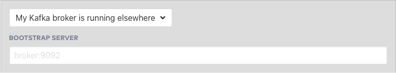

---
seo:
  title: Getting Started with Apache Kafka and Java
  description: SEO description
hero:
  title: Getting Started with Apache Kafka and Java
  description: Hero description
---

# Getting Started with Apache Kafka and Java

## Introduction

In this tutorial, you will run a Java client application that produces
messages to and consumes messages from an Apache Kafka® cluster. The
tutorial will walk you through setting up a local Kafka cluster if you
do not already have access to one.

*Continue*: I'm ready to start

## Prerequisites

This guide assumes that you already have:

[Gradle](https://gradle.org/install/) installed

[Java 11](https://www.oracle.com/java/technologies/javase-downloads.html)
installed and configured as the current java version for the environment

Later in this tutorial you will set up a new Kafka cluster or connect
to an existing one. If you wish to run a local Kafka cluster, you will
also need [Docker](https://docs.docker.com/get-docker/) installed
(this tutorial uses the new docker compose command, see the [Docker
documentation for more
information](https://docs.docker.com/compose/cli-command/#new-docker-compose-command)).

*Continue*: I have the required software

## Create Project

Create a new directory anywhere you'd like for this project:

```sh
mkdir kafka-java-getting-started && cd kafka-java-getting-started
```

Create the following Gradle build file for the project, named
`build.gradle`:

```gradle file=build.gradle
```

*Continue*: My project is setup

## Kafka Setup

We are going to need a Kafka Cluster for our client application to
operate with. This dialog can help you configure your Confluent Cloud
cluster, create a Kafka cluster for you, or help you input an existing
cluster bootstrap server to connect to.

<p>
<select data-context="true" name="kafka.broker">
  <option value="">Select Kafka Broker</option>
  <option value="cloud">Confluent Cloud</option>
  <option value="local">Local</option>
  <option value="other">Other</option>
</select>
</p>

<section data-context-key="kafka.broker" data-context-value="cloud">


Paste your Confluent Cloud bootstrap server setting here and the
tutorial will fill it into the appropriate configuration for you
</section>

<section data-context-key="kafka.broker" data-context-value="local">


Paste the following file into a `docker-compose.yml` file:

```yaml file=../docker-compose.yml
```

Now start the Kafka broker with: `docker compose up -d`
</section>


<section data-context-key="kafka.broker" data-context-value="other">



Paste your Kafka cluster bootstrap server URL here and the tutorial will
fill it into the appropriate configuration for you.
</section>

*Continue*: My Kafka cluster is ready

## Configuration

Paste the following configuration data into a file at:
`getting-started.properties`

<section data-context-key="kafka.broker" data-context-value="cloud">

The below configuration file includes the required settings for a
connection to Confluent Cloud including the bootstrap servers
configuration you provided. Include your Kafka cluster key and password
in the sasl.jaas.config setting after pasting the file.

```java file=getting-started-cloud.properties
```
</section>

<section data-context-key="kafka.broker" data-context-value="local">

```java file=getting-started-local.properties
```
</section>


<section data-context-key="kafka.broker" data-context-value="other">
The below configuration file includes the bootstrap servers
configuration you provided. If your Kafka Cluster requires different
client security configuration, you may require [different
settings](https://kafka.apache.org/documentation/#security).

```java file=getting-started-other.properties
```
</section>

*Continue*: My configuration is ready

## Create Topic

Events in Kafka are organized and durably stored in named topics. Topics
have parameters that determine the performance and durability guarantees
of the events that flow through them.

Create a topic which we will use to produce and consume events.

<section data-context-key="kafka.broker" data-context-value="cloud">

When using Confluent Cloud, you can use the [Cloud
UI](https://confluent.cloud/) to create a topic. Access your
running cluster and choose the menu items: Cluster -\> Topics -\> Add
Topic. Create a topic named my-topic with 1 partition and defaults for
the remaining settings.

You can also use the Confluent Cloud CLI to create topics, first
[install the
CLI](https://docs.confluent.io/ccloud-cli/current/install.html)
and then follow the instructions for [logging
in](https://docs.confluent.io/ccloud-cli/current/command-reference/ccloud_login.html)
and [creating a
topic](https://docs.confluent.io/ccloud-cli/current/command-reference/kafka/topic/ccloud_kafka_topic_create.html).

</section>

<section data-context-key="kafka.broker" data-context-value="local">

We'll use the `kafka-topics` command located inside the local running
Kafka broker:

```sh file=../create-topic.sh
```

</section>

<section data-context-key="kafka.broker" data-context-value="other">

Depending on your available Kafka cluster, you have multiple options for
creating a topic. You may have access to [Confluent Control
Center](https://docs.confluent.io/platform/current/control-center/index.html)
where you can create a topic with a UI. You may have already installed a
Kafka distribution, in which case you can use the kafka-topics
[command](https://kafka.apache.org/documentation/#basic_ops_add_topic).
</section>

*Continue*: My topic is created

## Build Producer

Create a directory for the Java files in this project:

```sh
mkdir -p src/main/java/examples
```

Paste the following Java code into a file located at `src/main/java/examples/ProducerExample.java`

```java file=src/main/java/examples/ProducerExample.java
```

#### You can test the code before preceding by compiling with:

```sh
gradle build
```
And you should see:


```
BUILD SUCCESSFUL
```

#### *Continue*: My Producer is ready

####  

## Build Consumer

Paste the following Java code into a file located at `src/main/java/examples/ConsumerExample.java`

```java file=src/main/java/examples/ConsumerExample.java
```

#### Once again, you can compile the code before preceding by with:

```sh
gradle build
```

And you should see:

```
BUILD SUCCESSFUL
```

*Continue*: My Consumer is ready

## Produce Events

To build a JAR that we can run from the command line, first run:

```sh
gradle shadowJar
```

And you should see:

```
BUILD SUCCESSFUL
```

Run the following command to build and execute the producer application,
which will produce some random data events to the `my-topic` topic.

```sh
java -cp build/libs/kafka-java-getting-started-0.0.1.jar examples.ProducerExample getting-started.properties my-topic
```

You should see output that resembles:

```
Producing random data string with Key: 10 JQUgQ
Producing random data string with Key: 4 bapQe
Producing random data string with Key: 4 teKAJ
Producing random data string with Key: 10 DMLhy
Producing random data string with Key: 2 msXas
Producing random data string with Key: 10 jlcuN
Producing random data string with Key: 4 iiXLK
Producing random data string with Key: 1 goftH
Producing random data string with Key: 4 UMPee
Producing random data string with Key: 7 LSkgY
Produced record to topic my-topic partition [0] @ offset 0
Produced record to topic my-topic partition [0] @ offset 1
Produced record to topic my-topic partition [0] @ offset 2
Produced record to topic my-topic partition [0] @ offset 3
Produced record to topic my-topic partition [0] @ offset 4
Produced record to topic my-topic partition [0] @ offset 5
Produced record to topic my-topic partition [0] @ offset 6
Produced record to topic my-topic partition [0] @ offset 7
Produced record to topic my-topic partition [0] @ offset 8
Produced record to topic my-topic partition [0] @ offset 9
10 messages were produced to topic my-topic
```

*Continue*: My events were produced

## Consume Events

From another terminal, run the following command to run the consumer
application which will read the events from the my-topic topic and write
the information to the terminal.

Re-run the producer to see more events, or feel free to modify the code
as necessary to create more or different events.

```sh
java -cp build/libs/kafka-java-getting-started-0.0.1.jar examples.ConsumerExample getting-started.properties my-topic
```

The consumer application will start and print any events it has not
yet consumed and then wait for more events to arrive. On startup of
the consumer, you should see output that resembles the below. Once you
are done with the consumer, press `ctrl-c` to terminate the consumer
application.

```
Consumed record with key 10 and value JQUgQ
Consumed record with key 4 and value bapQe
Consumed record with key 4 and value teKAJ
Consumed record with key 10 and value DMLhy
Consumed record with key 2 and value msXas
Consumed record with key 10 and value jlcuN
Consumed record with key 4 and value iiXLK
Consumed record with key 1 and value goftH
Consumed record with key 4 and value UMPee
Consumed record with key 7 and value LSkgY
```

## Where next?

- For information on testing in the Kafka ecosystem, check out the testing page.
- If you're interested in stream processing, check out the ksqlDB
  course.
- Interested in taking Java applications to production? Check out the monitoring page.
