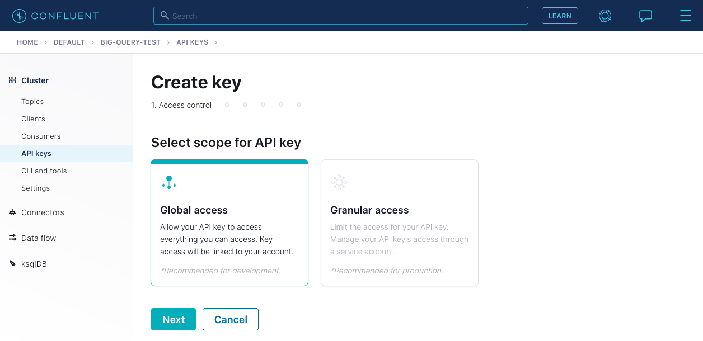
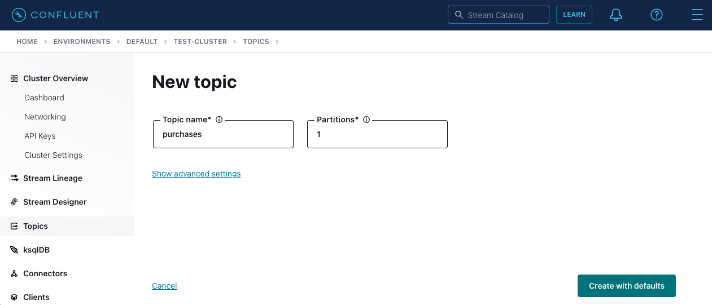

---
seo:
  title: Apache Kafka and Java - Getting Started Tutorial 
  description: How to run a Kafka client application written in Java that produces to and consumes messages from a Kafka cluster, with step-by-step setup instructions and examples. 
hero:
  title: Getting Started with Apache Kafka and Java
  description: Step-by-step guide to building a Java client application for Kafka 
---

# Getting Started with Apache Kafka and Java

## Introduction

In this tutorial, you will run a Java client application that produces
messages to and consumes messages from an Apache Kafka® cluster. 

As you're learning how to run your first Kafka application, we recommend using [Confluent Cloud](https://www.confluent.io/confluent-cloud/tryfree) (no credit card required to sign up) so you don't have to run your own Kafka cluster and you can focus on the client development. But if you prefer to setup a local Kafka cluster, the tutorial will walk you through those steps.

<div class="alert-primary">
<p>
Note: This tutorial focuses on a simple application to get you started.
If you want to build more complex applications and microservices for data in motion—with powerful features such as real-time joins, aggregations, filters, exactly-once processing, and more—check out the <a href="/learn-kafka/kafka-streams/get-started/">Kafka Streams 101 course</a>, which covers the
<a href="https://docs.confluent.io/platform/current/streams/index.html">Kafka Streams client library</a>.
</p>
</div>

## Prerequisites

This guide assumes that you already have:

- [Gradle](https://gradle.org/install/) installed
- [Java 11](https://openjdk.org/install/) installed and configured as the current Java version for the environment.
  Verify that `java -version` outputs version 11 and ensure that the `JAVA_HOME` environment variable is set to the Java
  installation directory containing `bin`.

Later in this tutorial you will set up a new Kafka cluster or connect
to an existing one. 

If you do not have an existing cluster to use, the easiest way to run Kafka is 
with [Confluent Cloud](https://www.confluent.io/confluent-cloud/). If you do not already have an account, 
be sure to [sign up](https://www.confluent.io/confluent-cloud/tryfree/). 
New signups [receive $400](https://www.confluent.io/confluent-cloud-faqs/#how-can-i-get-up-to-dollar400-in-free-confluent-cloud-usage) 
to spend within Confluent Cloud during their first 60 days.

From within the Confluent Cloud Console, creating a new cluster is just a few clicks:
<video autoplay muted playsinline poster="https://images.ctfassets.net/gt6dp23g0g38/4JMGlor4A4ad1Doa5JXkUg/bcd6f6fafd5c694af33e91562fd160c0/create-cluster-preview.png" loop>
	<source src="https://videos.ctfassets.net/gt6dp23g0g38/6zFaUcKTgj5pCKCZWb0zXP/6b25ae63eae25756441a572c2bbcffb6/create-cluster.mp4" type="video/mp4">
Your browser does not support the video tag.
</video>

If you cannot use Confluent Cloud, you can use an existing Kafka cluster or run one locally using [Docker](https://docs.docker.com/get-docker/).

## Create Project

Create a new directory anywhere you'd like for this project:

```sh
mkdir kafka-java-getting-started && cd kafka-java-getting-started
```

Create the following Gradle build file for the project, named
`build.gradle`:

```gradle file=build.gradle
```

## Kafka Setup

We are going to need a Kafka Cluster for our client application to
operate with. This dialog can help you configure your Confluent Cloud
cluster, create a Kafka cluster for you, or help you input an existing
cluster bootstrap server to connect to.

<p>
  <label>Kafka location</label>
  <div class="select-wrapper">
    <select data-context="true" name="kafka.broker">
      <option value="cloud">Confluent Cloud</option>
      <option value="local">Local</option>
      <option value="other">Other</option>
    </select>
  </div>
</p>

<section data-context-key="kafka.broker" data-context-value="cloud" data-context-default>

After you sign up for [Confluent Cloud](https://www.confluent.io/confluent-cloud/tryfree/)
and provision your Kafka cluster,
paste your Confluent Cloud bootstrap server setting below and the
tutorial will fill in the appropriate configuration for
you.

<p>
  <label for="kafka-broker-server">Bootstrap Server</label>
  <input id="kafka-broker-server" data-context="true" name="kafka.broker.server" placeholder="cluster-id.region.provider.confluent.cloud:9092" />
</p>

You can obtain your Confluent Cloud Kafka cluster bootstrap server
configuration using the [Confluent Cloud Console](https://confluent.cloud/):
<video autoplay muted playsinline poster="https://images.ctfassets.net/gt6dp23g0g38/nrZ31F1vVHVWKpQpBYzi1/a435b23ed68d82c4a39fa0b4472b7b71/get-cluster-bootstrap-preview.pn://images.ctfassets.net/gt6dp23g0g38/nrZ31F1vVHVWKpQpBYzi1/dd72c752e9ed2724edc30a7f9eb77ccb/get-cluster-bootstrap-preview.png" loop>
	<source src="https://videos.ctfassets.net/gt6dp23g0g38/n9l0LvX4FmVZSCGUuHZh3/b53a03f62bb92c2ce71a7c4a23953292/get-cluster-bootstrap.mp4" type="video/mp4">
Your browser does not support the video tag.
</video>

</section>

<section data-context-key="kafka.broker" data-context-value="local">
  
Paste the following file into a `docker-compose.yml` file:

```yaml file=../docker-compose.yml
```

Now start the Kafka broker with the new `docker compose` command (see the [Docker
documentation for more information](https://docs.docker.com/compose/cli-command/#new-docker-compose-command)).

```sh
docker compose up -d
```

</section>

<section data-context-key="kafka.broker" data-context-value="other">
  
<p>
  <label for="kafka-broker-server">Bootstrap Server</label>
  <input id="kafka-broker-server" data-context="true" name="kafka.broker.server" placeholder="broker:9092" />
</p>

Paste your Kafka cluster bootstrap server URL above and the tutorial will
fill it into the appropriate configuration for you.

</section>

## Configuration

<section data-context-key="kafka.broker" data-context-default>
  Please go back to the Kafka Setup section and select a broker type.
</section>

<section data-context-key="kafka.broker" data-context-value="cloud">

When using Confluent Cloud you will be required to provide an API key
and secret authorizing your application to produce and consume. You can
use the [Confluent Cloud Console](https://confluent.cloud/) to create a key for
you by navigating to the `API Keys` section under `Cluster Overview`.



Copy and paste the following configuration data into a file named `getting-started.properties`, substituting the API key and
secret that you just created for the `username` and `password` fields, respectively, in the `sasl.jaas.config` value.
Note that bootstrap server endpoint that you provided in the `Kafka Setup` step is used as the value corresponding to 
`bootstrap.servers`.

```properties file=getting-started-cloud.properties
```

</section>

<section data-context-key="kafka.broker" data-context-value="local">

Paste the following configuration data into a file named `getting-started.properties`:

```properties file=getting-started-local.properties
```

</section>

<section data-context-key="kafka.broker" data-context-value="other">

Paste the following configuration data into a file named `getting-started.properties`.

The below configuration file includes the bootstrap servers
configuration you provided. If your Kafka Cluster requires different
client security configuration, you may require [different
settings](https://kafka.apache.org/documentation/#security).

```properties file=getting-started-other.properties
```

</section>

## Create Topic

Events in Kafka are organized and durably stored in named topics. Topics
have parameters that determine the performance and durability guarantees
of the events that flow through them.

Create a new topic, `purchases`, which we will use to produce and consume
events.

<section data-context-key="kafka.broker" data-context-value="cloud" data-context-default="true">



When using Confluent Cloud, you can use the [Confluent Cloud
Console](https://confluent.cloud/) to create a topic. Create a topic
with 1 partition and defaults for the remaining settings.

</section>

<section data-context-key="kafka.broker" data-context-value="local">

We'll use the `kafka-topics` command located inside the local running
Kafka broker:

```sh file=../create-topic.sh
```
</section>

<section data-context-key="kafka.broker" data-context-value="other">

Depending on your available Kafka cluster, you have multiple options
for creating a topic. You may have access to [Confluent Control
Center](https://docs.confluent.io/platform/current/control-center/index.html),
where you can [create a topic with a
UI](https://docs.confluent.io/platform/current/control-center/topics/create.html). You
may have already installed a Kafka distribution, in which case you can
use the [kafka-topics command](https://kafka.apache.org/documentation/#basic_ops_add_topic).
Note that, if your cluster is centrally managed, you may need to
request the creation of a topic from your operations team.

</section>

## Build Producer

Create a directory for the Java files in this project:

```sh
mkdir -p src/main/java/examples
```

Paste the following Java code into a file located at `src/main/java/examples/ProducerExample.java`

```java file=src/main/java/examples/ProducerExample.java
```

You can test the code before preceding by compiling with:

```sh
gradle build
```
And you should see:

```
BUILD SUCCESSFUL
```

## Build Consumer

Paste the following Java code into a file located at `src/main/java/examples/ConsumerExample.java`

```java file=src/main/java/examples/ConsumerExample.java
```

Once again, you can compile the code before preceding by with:

```sh
gradle build
```

And you should see:

```
BUILD SUCCESSFUL
```

## Produce Events

To build a JAR that we can run from the command line, first run:

```sh
gradle shadowJar
```

And you should see:

```
BUILD SUCCESSFUL
```

Run the following command to build and execute the producer application,
which will produce some random data events to the `purchases` topic.

```sh
java -cp build/libs/kafka-java-getting-started-0.0.1.jar examples.ProducerExample getting-started.properties
```

You should see output that resembles:

```
Produced event to topic purchases: key = awalther   value = t-shirts
Produced event to topic purchases: key = htanaka    value = t-shirts
Produced event to topic purchases: key = htanaka    value = batteries
Produced event to topic purchases: key = eabara     value = t-shirts
Produced event to topic purchases: key = htanaka    value = t-shirts
Produced event to topic purchases: key = jsmith     value = book
Produced event to topic purchases: key = awalther   value = t-shirts
Produced event to topic purchases: key = jsmith     value = batteries
Produced event to topic purchases: key = jsmith     value = gift card
Produced event to topic purchases: key = eabara     value = t-shirts
10 events were produced to topic purchases
```

## Consume Events

From another terminal, run the following command to run the consumer
application which will read the events from the `purchases` topic and write
the information to the terminal.

Re-run the producer to see more events, or feel free to modify the code
as necessary to create more or different events.

```sh
java -cp build/libs/kafka-java-getting-started-0.0.1.jar examples.ConsumerExample getting-started.properties
```

The consumer application will start and print any events it has not
yet consumed and then wait for more events to arrive. On startup of
the consumer, you should see output that resembles the below. Once you
are done with the consumer, press `ctrl-c` to terminate the consumer
application.

```
Consumed event from topic purchases: key = awalther   value = t-shirts
Consumed event from topic purchases: key = htanaka    value = t-shirts
Consumed event from topic purchases: key = htanaka    value = batteries
Consumed event from topic purchases: key = eabara     value = t-shirts
Consumed event from topic purchases: key = htanaka    value = t-shirts
Consumed event from topic purchases: key = jsmith     value = book
Consumed event from topic purchases: key = awalther   value = t-shirts
Consumed event from topic purchases: key = jsmith     value = batteries
Consumed event from topic purchases: key = jsmith     value = gift card
Consumed event from topic purchases: key = eabara     value = t-shirts
```

## Where next?

- For the Java client API, check out the
  [Java documentation](https://docs.confluent.io/platform/current/clients/javadocs/javadoc/index.html).
- Kafka Streams allows you to build advanced Java applications that include powerful features such as real-time joins, aggregations, filters, and exactly-once processing. The [Kafka Streams 101 course](/learn-kafka/kafka-streams/get-started/) provides an in-depth approach including videos and exercises. For quick hands-on approach, see the [How to build your first Apache Kafka Streams application](https://kafka-tutorials.confluent.io/creating-first-apache-kafka-streams-application/confluent.html) tutorial.
- For information on testing in the Kafka ecosystem, check out
  [Testing Event Streaming Apps](/learn/testing-kafka).
- Interested in performance tuning of your event streaming applications?
  Check out the [Kafka Performance resources](/learn/kafka-performance/).
